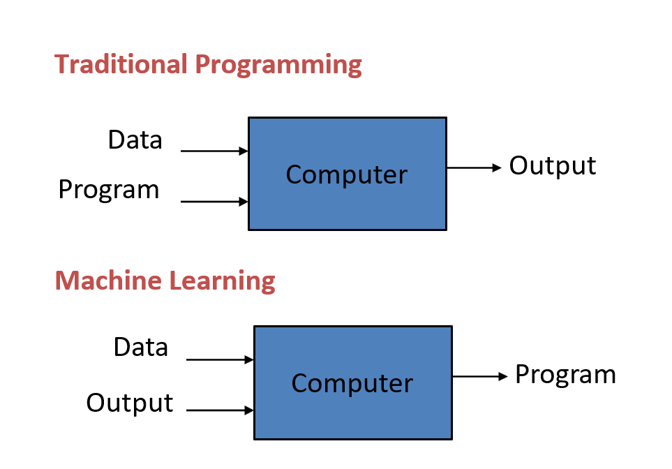
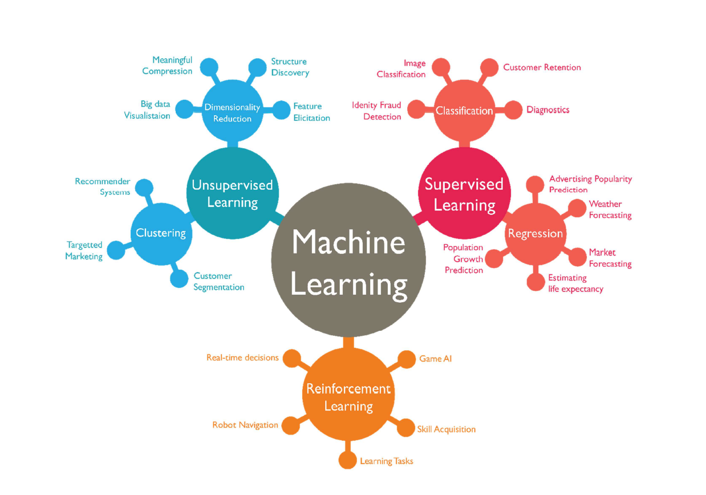
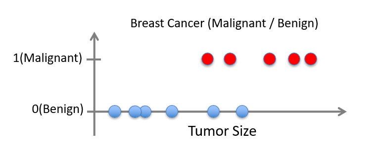
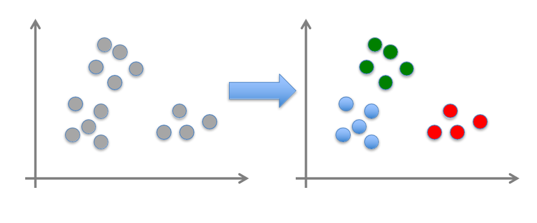
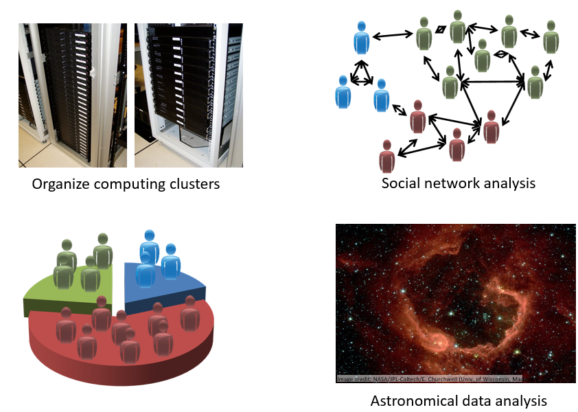

# Introduction To Machine Learning

## What is Machine Learning ?

_Machine learning is programming computers to optimize a performance criterion using example data or past experience._

Machine Learning is the study of algorithms that:

- improve their performance **P**
- at some task **T**
- with experience **E**.

A well-defined learning task is given by **<P, T, E>**.

Machine learning focuses on software algorithms that learn from experience and improve their decision-making or predictive performance over time.

## When Do We Use Machine Learning ?

**"Human expertise does not exist (navigating on Mars)"**

- We use machine learning when there are situations where humans have no experience, like driving a robot on Mars where no one has ever been, and there are no clear rules to follow.

**"Humans can’t explain their expertise (speech recognition)"**

- Machine learning is useful when people do things naturally but can’t fully explain how, like understanding speech. We know how to recognize voices or words, but it’s hard to explain every little detail of how we do it.

**"Models must be customized (personalized medicine)"**

- In some cases, like treating patients, each person is different. Machine learning helps create solutions that are tailored specifically for individuals, like choosing the best medicine for someone based on their unique health data.

**"Models are based on huge amounts of data (genomics)"**

- When there is a massive amount of information, such as DNA data in genomics, machine learning helps make sense of it because it can quickly process and learn from huge datasets that humans can't handle easily.

<!-- new line -->

**Learning isn't always useful**: There is no need to "learn" to calculate payroll

## Best Tasks Solvable By Machine Learning

1. **Pattern Recognition**

   - **Image Recognition**: ML is used to identify objects, faces, or scenes in images (e.g., facial recognition systems).

   - **Speech Recognition**: ML helps in converting spoken language into text or commands (e.g., virtual assistants like Siri or Alexa).

   - **Handwriting Recognition**: Recognizing characters in handwritten text (e.g., digitizing written documents).

2. **Prediction and Forecasting**

   - **Stock Market Predictions**: Predicting future stock prices based on historical data.
   - **Weather Forecasting**: Improving the accuracy of weather predictions by analyzing past weather patterns.

   - **Sales Forecasting**: Using past sales data to predict future trends and demands.

3. **Automation and Optimization**:

   - **Recommendation Systems**: ML helps suggest products or content to users based on their past behavior (e.g., Netflix or Amazon recommendations).
   - **Autonomous Systems**: Self-driving cars use ML to make decisions about navigation and obstacle avoidance.

   - **Robotics**: Optimizing robots' movements and tasks in real-time based on data.

4. **Medical Applications**

   - **Disease Diagnosis**: ML algorithms analyze medical images, patient records, and genetic data to assist in diagnosis (e.g., detecting tumors).

   - **Drug Discovery**: Predicting which chemical compounds are likely to be effective drugs based on past research data.

5. **Clustering and Segmentation**

   - **Customer Segmentation**: Grouping customers based on their purchasing behaviors to tailor marketing strategies.

   - **Image Segmentation**: Dividing an image into regions or objects for further analysis (e.
     g., in medical imaging).

6. **Personalization**

   - **Advertising**: Targeting advertisements based on user behavior, preferences, and demographics.

   - **Content Personalization**: Providing personalized news feeds, product suggestions, or learning paths for users.

## Types of Machine Learning

#### Supervised Learning (SL)

is the machine learning task of learning a function that maps an input to an output based on example input-output pairs. It infers a function from labeled training data consisting of a set of training examples. Supervised learning, also known as supervised machine learning, is a subcategory of machine learning and artificial intelligence. It is defined by its use of labeled datasets to train algorithms that to classify data or predict outcomes accurately.

**Given: training data + desired outputs (labels)**

##### Regression

- Given (x1, y1), (x2, y2), ..., (xn, yn)
- Learn a function f(x) to predict y given x
  - y is real-valued == regression

##### Classification

- Given (x1, y1), (x2, y2), ..., (xn, yn)
- Learn a function f(x) to predict y given x
  - y is categorical == classification

#### Unsupervised Learning (UL)

**Unsupervised Learning** also known as unsupervised machine learning, uses machine learning algorithms to analyze and cluster unlabeled datasets. These algorithms discover hidden patterns or data groupings without the need for human intervention.

**Given: training data (without desired outputs)**

- Given x1, x2, ..., xn (without labels)
- Output hidden structure behind the x's
  - E.g., clustering

#### Semi-Supervised Learning

**Semi-supervised learning** is an approach to machine learning that combines a small amount of labeled data with a large amount of unlabeled data during training. Semi-supervised learning falls between unsupervised learning (with no labeled training data) and supervised learning (with only labeled training data). It is a special instance of weak supervision. Unlabeled data, when used in conjunction with a small amount of labeled data, can produce considerable improvement in learning accuracy.

- Given x1, x2, ..., xn (without labels)
- Output hidden structure behind the x's
  - E.g., clustering

#### Reinforcement Learning

**Reinforcement learning** is a machine learning training method based on rewarding desired behaviors and/or punishing undesired ones. In general, a reinforcement learning agent is able to perceive and interpret its environment, take actions and learn through trial and error.

Given a sequence of states and actions with (delayed) rewards, output a policy

- Policy is a mapping from states  actions that tells you what to do in a given state

Examples:

- Credit assignment problem
- Game playing
- Robot in a maze
- Balance a pole on your hand

## Machine Learning in Practice (circle)

[loop]

- Understand domain, prior knowledge, and goals
- Data integration, selection, cleaning, pre-processing, etc.
- Learn models
- Interpret results
- Consolidate and deploy discovered knowledge
