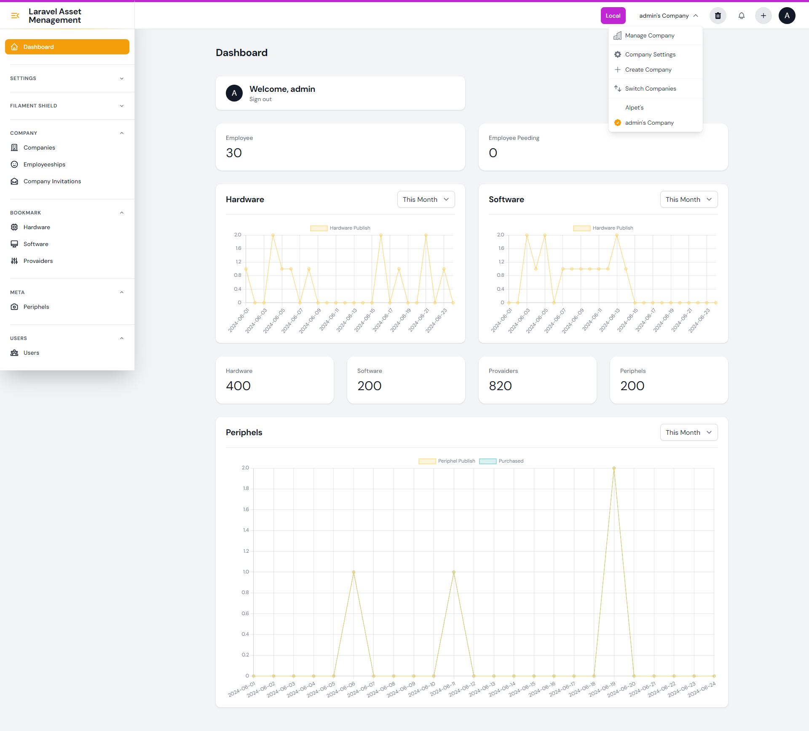
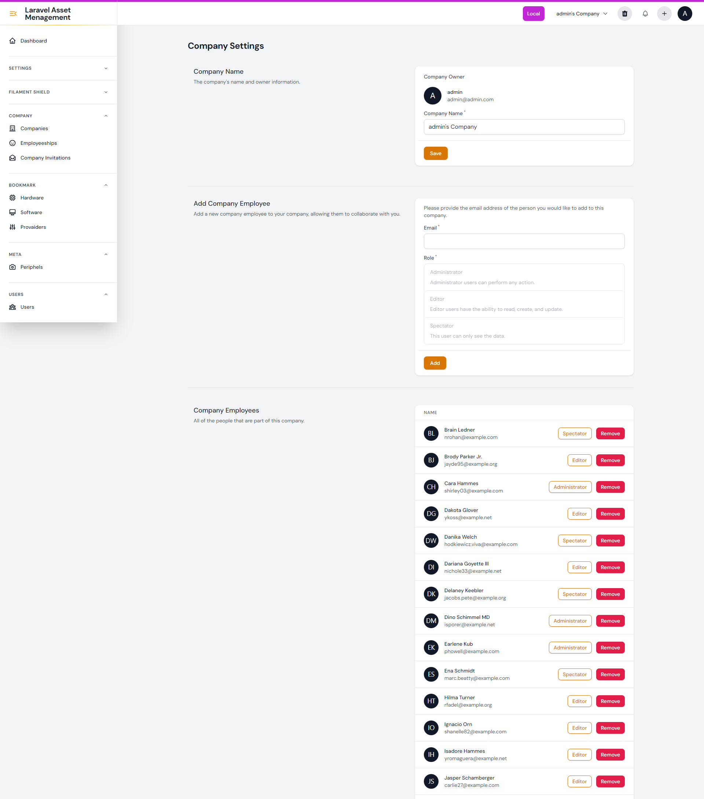
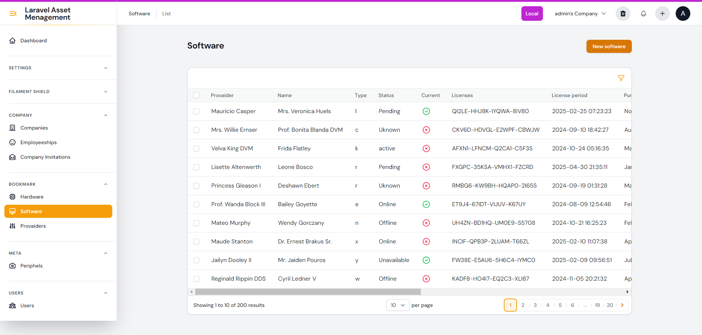
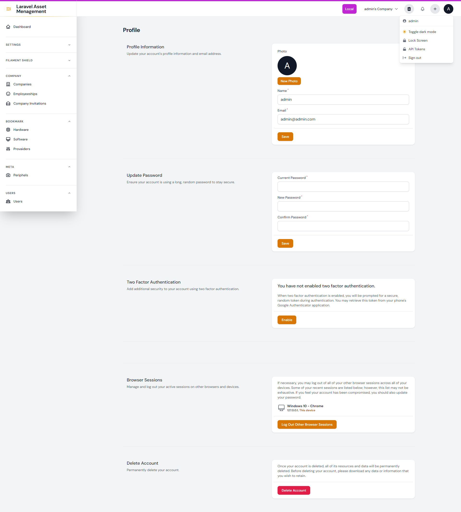

# Assets Management

Asset Management it's any process a company or organization uses to keep track of the equipment and inventory vital to the day-to-day operation of their business.

### Short Descroption

Asset Management product allows you to efficiently manage multiple companies, creating hardware, software, providers, and peripherals to organize your assets. You can also add employees, customize company and user settings, and configure roles and permissions. The system includes an activity log to monitor all actions for enhanced security. Streamline your asset management with our comprehensive and user-friendly solution.

### Technologies Used

- Laravel
- MySQL
- Livewire
- TailwindCSS
- Filamentphp

### Features

- USER & ADMIN Dashboard
- Multi Companies
- Profile Customization | 2FA | Password Reset
- User Management
- Role & Permission
- Software Management
- Hardware Management
- Provider Management
- Peripherals Management
- Activity Log
- Notification
- Quick Create
- CSV Export
- Employee Management
- Company Settings

### Image of the App

