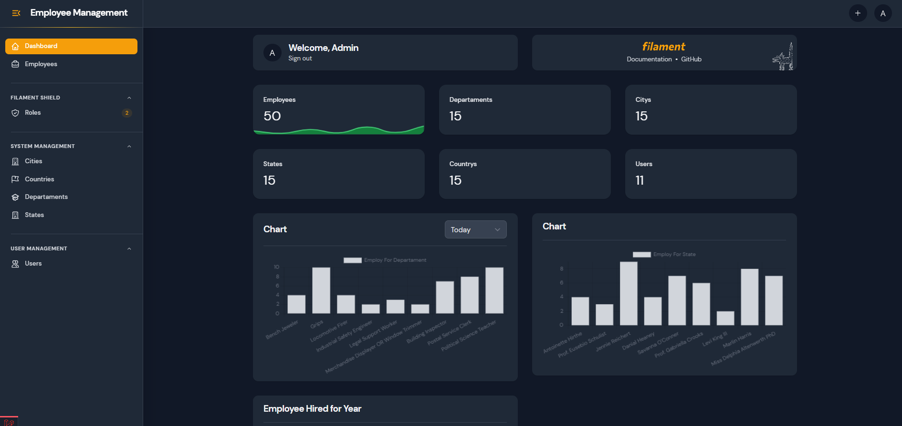
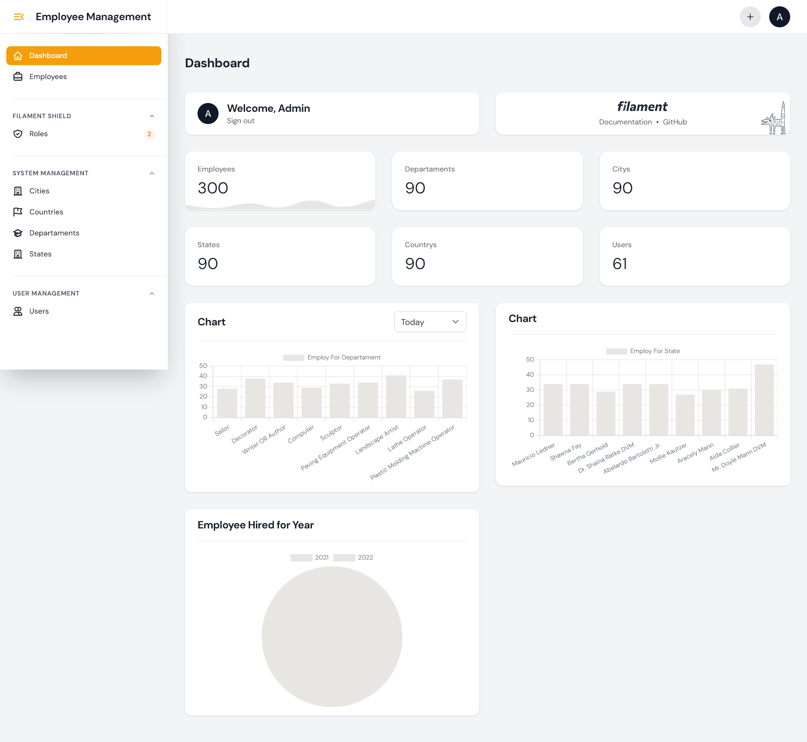
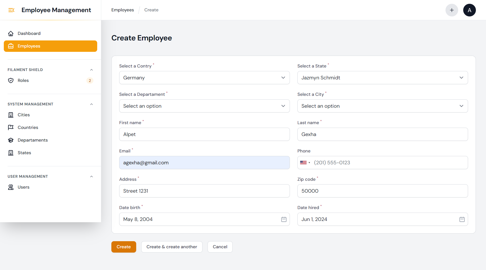

# Employee Management App

### Short Descroption

Employee Management app enables you to create, manage, and analyze employee data efficiently. Organize your workforce by adding departments, cities, continents, and statistics. The app also provides robust role and permission management, ensuring streamlined operations and secure access control. Enhance your employee management capabilities with our comprehensive and user-friendly solution.

### Technologies Used

- Larvel
- Livewire
- Filamentphp
- MySQL

### Features

- Analytics
- Departments
- Cities
- Continents
- Role & Permission
- Employee Management
- Activity Log
- User Management

### Image of the App

