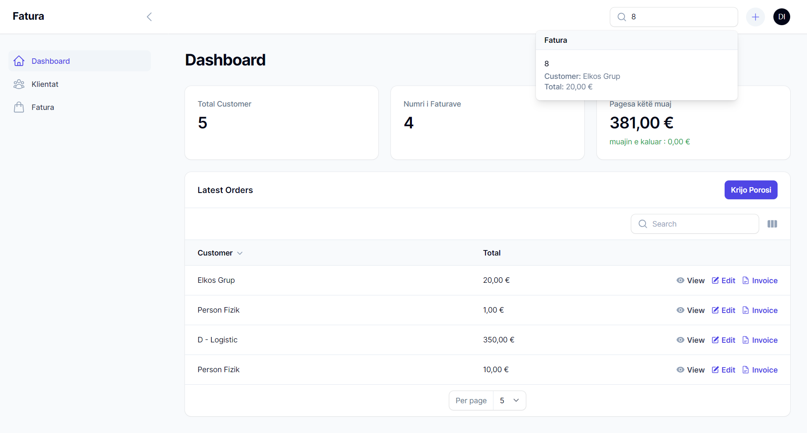
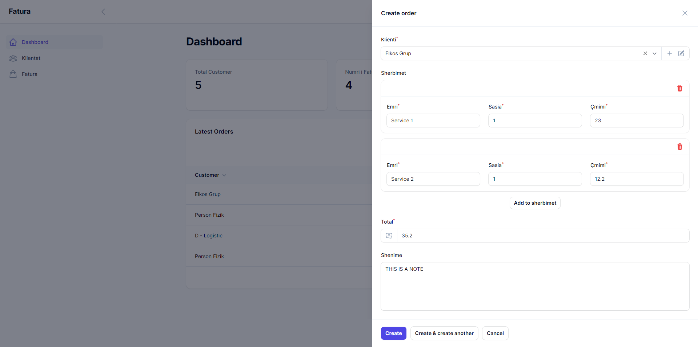
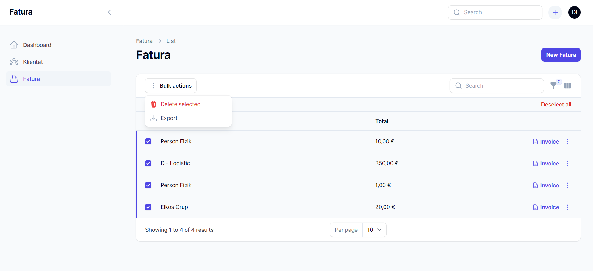

# Fatura

### Short Descroption

Project description. With this app, you can effortlessly save and organize your orders, generate professional invoices, and export data in .csv format. Tailor your data with customizable filters to meet your specific requirements. Enhance your business
efficiency and accuracy with our user-friendly and reliable solution.

### Technologies Used

- Laravel
- Filament

### Features

- Stats
- Client
- Order
- Global Search
- Invoice
- CSV Export

### Image of the App

<!--  -->

<!--  -->
