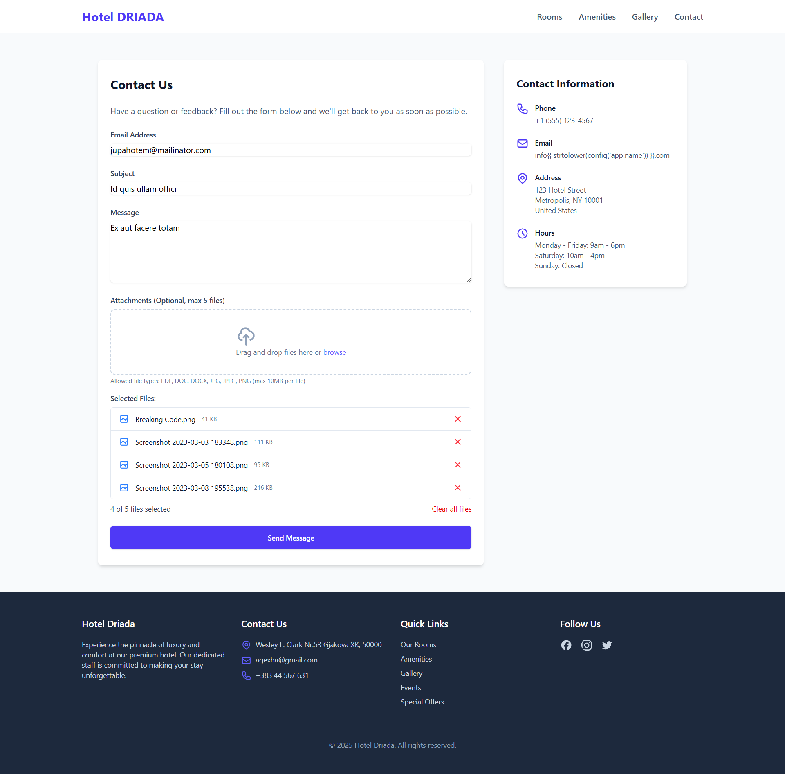

# Hotel Booking

A modern, full-featured hotel reservation system built with the TALL stack (Tailwind CSS, Alpine.js, Laravel, and Livewire), enabling hotel administrators to manage rooms, bookings, and customers efficiently while providing guests with a seamless booking experience.

## ✨ Features

- **User-friendly Booking System**: Intuitive interface for guests to search, filter, and book rooms
- **Multi-booking Support**: Book multiple rooms in a single transaction
- **Room Management**: Comprehensive system for adding, editing, and categorizing rooms and room types
- **Availability Checking**: Real-time room availability verification
- **Admin Dashboard**: Powerful admin interface for monitoring bookings and managing hotel operations
- **Dynamic Room Filtering**: Search rooms by date, amenities, capacity, and other criteria
- **Alternative Room Suggestions**: Smart system to suggest similar rooms when preferred options aren't available
- **Responsive Design**: Fully responsive interface that works seamlessly on all devices
- **Contact Management**: System to handle customer inquiries and communications

## 💻 Usage

### For Guests

1. **Browse Rooms**: Visit the homepage to see all available rooms
2. **Search & Filter**: Use filters to find rooms matching specific criteria
3. **Make Reservations**: Select check-in/check-out dates and complete the booking process
4. **Contact Management**: Reach out via the contact form for special requests or inquiries

### For Administrators

1. **Access Admin Panel**: Log in to the admin dashboard with admin credentials
2. **Manage Rooms**: Add, edit, or remove rooms and room types
3. **Handle Bookings**: View, confirm, modify, or cancel existing bookings
4. **Customer Management**: Track customer information and communication

## 📷 Screenshots

### Guest Experience

#### Home Page

#### Room Selection

#### Room Filtering

#### Booking Process

#### Contact Page

#### Amenities Page

### Administrator Dashboard

## 🛠 Technologies Used

- **Laravel 12**: PHP framework providing the application backend
- **Livewire**: Full-stack framework for dynamic interfaces with Laravel
- **Alpine.js**: Lightweight JavaScript framework for interactivity
- **Tailwind CSS**: Utility-first CSS framework for styling
- **Filament**: Admin panel toolkit for rapid development
