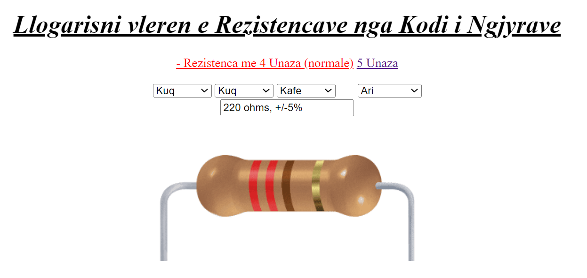
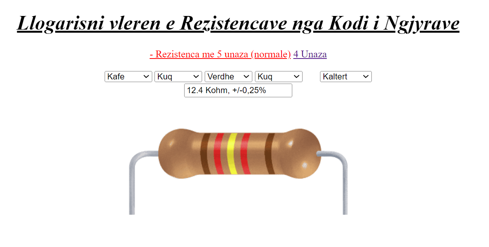

# Kodi-i-Resistecave

...

### Short Descroption

the program that calculates the resistance of the resistor based on the color of the resistor. The program will take the color of the resistor and return the resistance of the resistor.

### Technologies Used

- Javascript

### Features

- Calculate the resistance of with 4 color
- Calculate the resistance of with 5 color

### Image of the App

