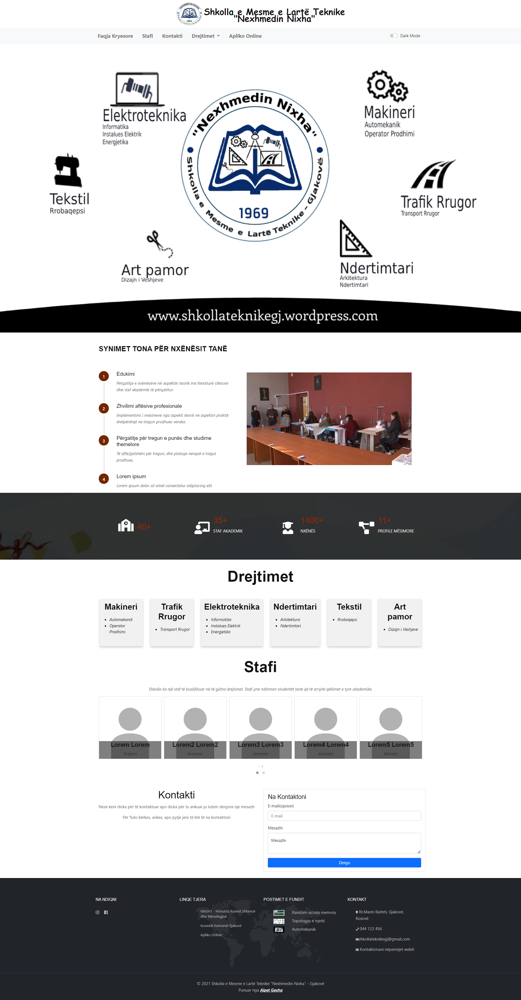
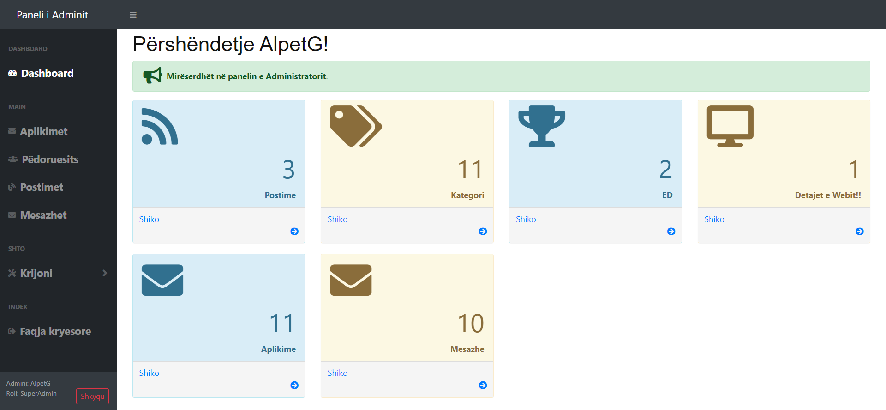
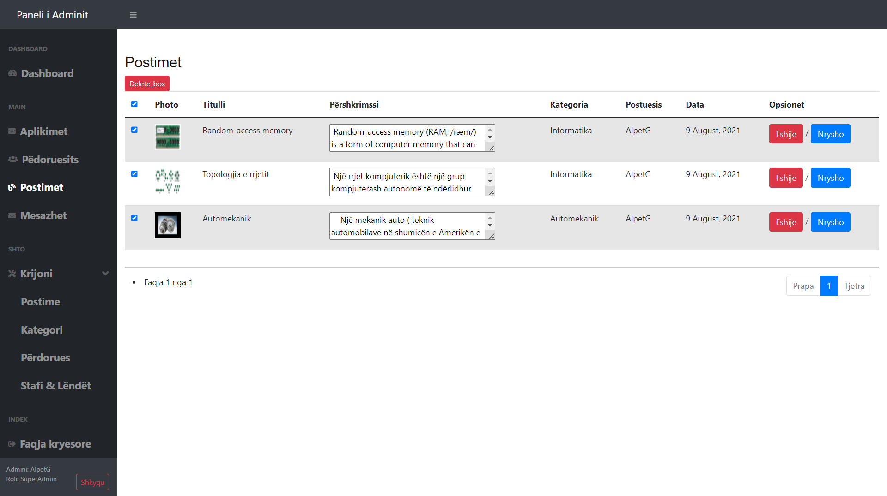
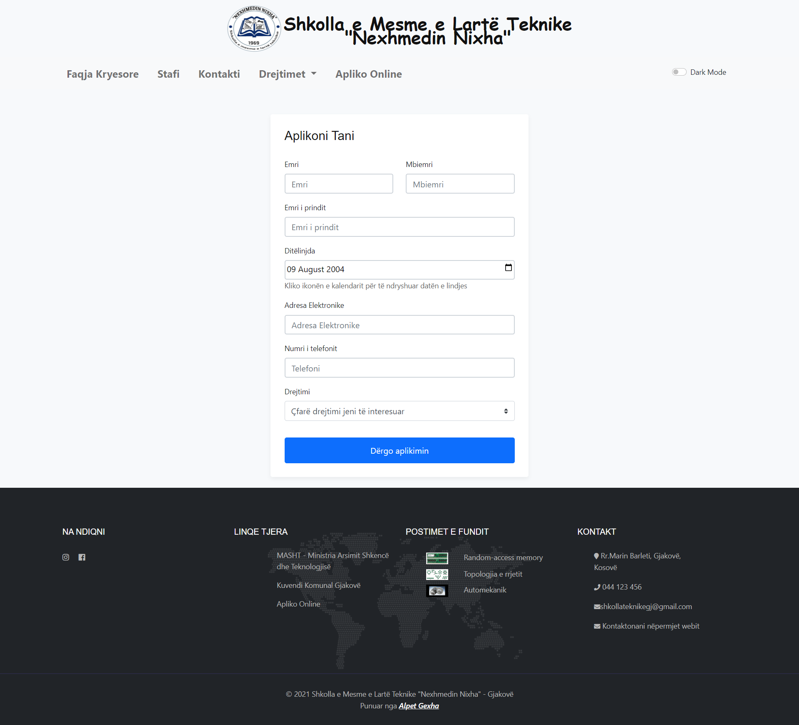
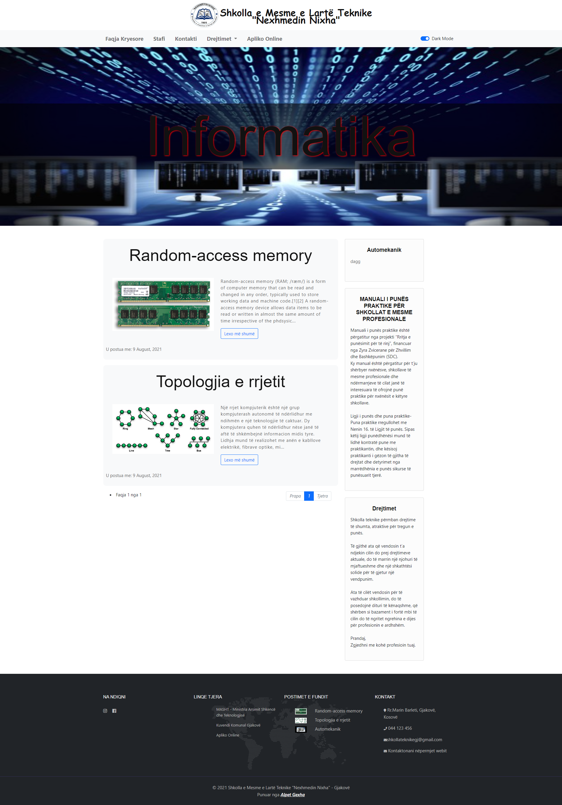
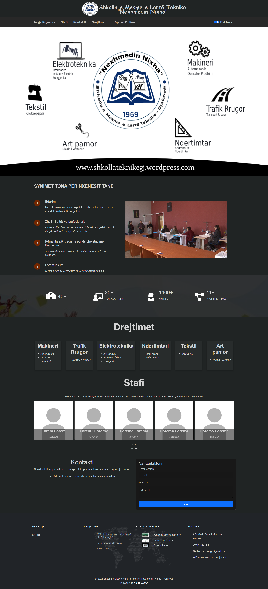

# Nexhmedin Nixha

Webiste for School Management System

### Short Descroption

Project description. School Website showcases your institution's offerings, allowing you to display degrees and share materials for each program. Students can easily apply online, enhancing the enrollment process. Elevate your school's online presence with a user-friendly, comprehensive website that effectively communicates your educational value.

### Technologies Used

- HTML | CSS | JavaScript
- Bootstrap
- PHP
- MySQL

### Features

- Contact Form
- Admin Panel
- User Panel
- User Authentication
- Blog And Sharing Resources base on Deagrea
- Online Application Form
- Responsive Design
- Dark Mode

### Image of the App

