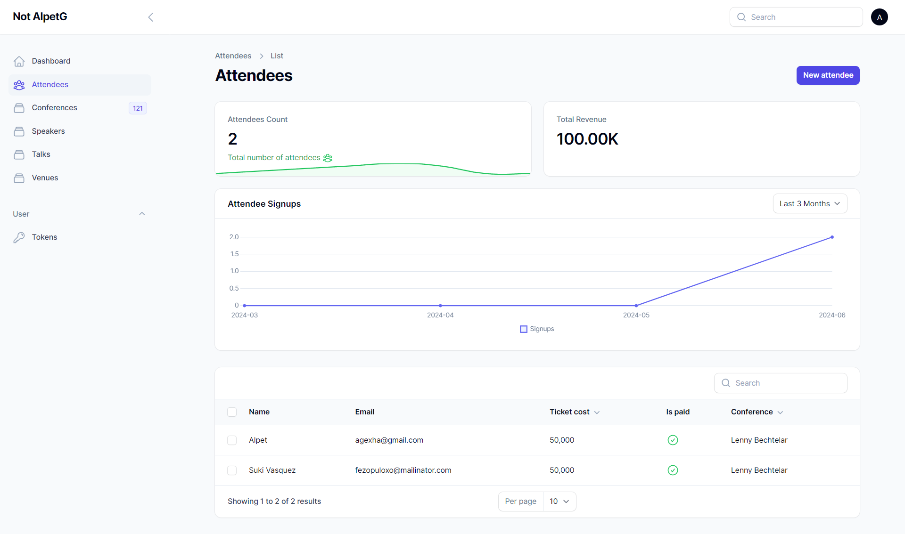
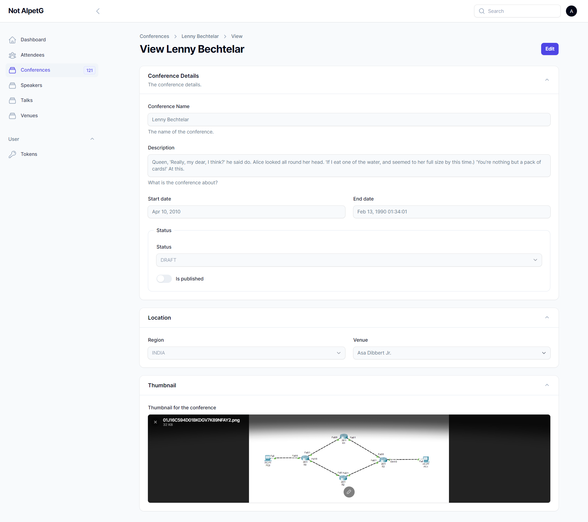
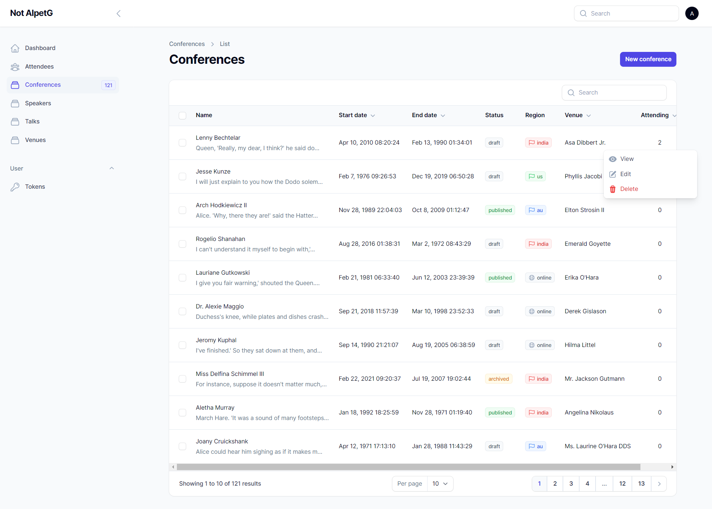
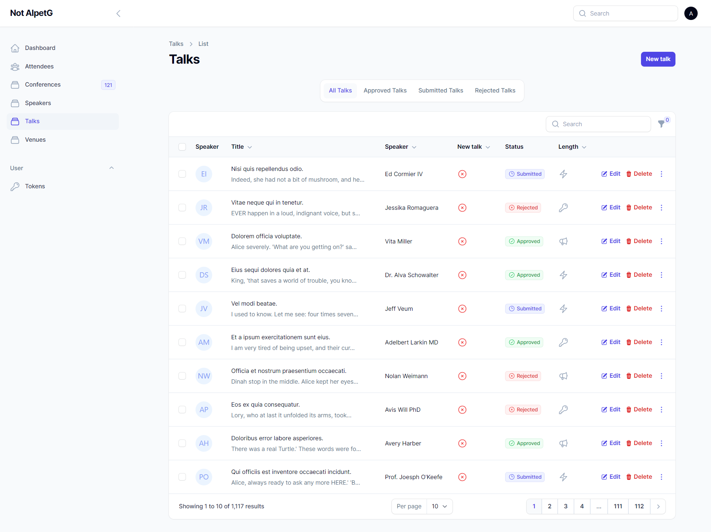
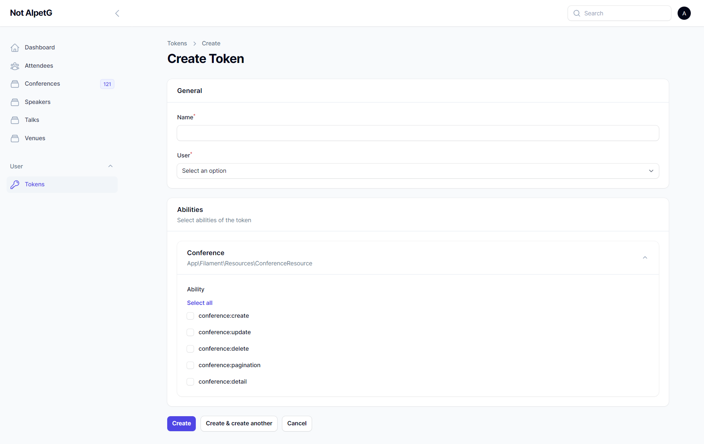
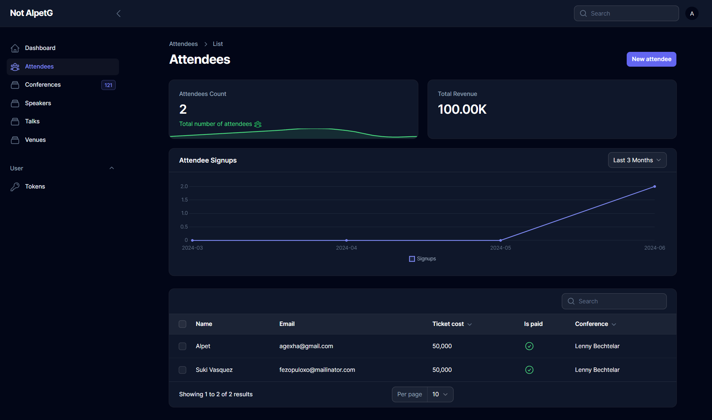

# Conference Management

### Short Descroption

Our application enables you to create and manage conferences effortlessly. Organize speaker talks, attendees, and venues with ease. Additionally, generate API tokens for seamless integration with other systems. Enhance your event planning and execution with our comprehensive, user-friendly solution.

### Technologies Used

- Laravel
- Filamentphp

### Features

- Create and manage conferences
- Add and manage speakers
- Add and manage attendees
- Add and manage venues
- Generate API tokens
- CSV export for attendees

### Image of the App

<!--  -->

