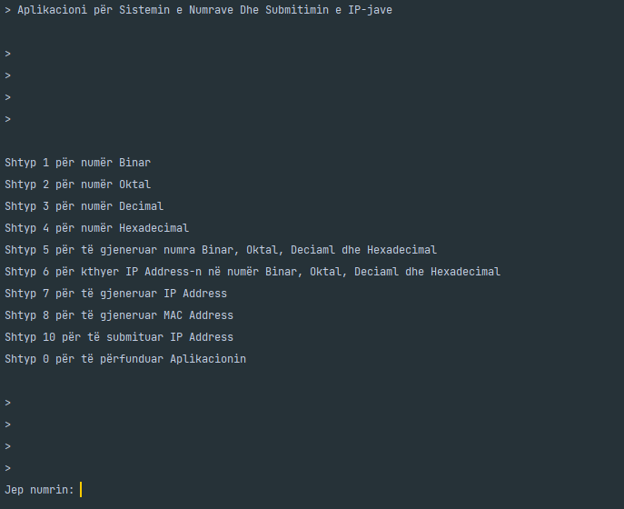

# System Number and IP Submission

### Short Descroption

A Program that let u to conert the Binary, Octal, Decimal, Hexadecimal number to each other and Subnetting IP Address

### Technologies Used

- Java

### Features

- Conversion of Binary numbers to Octal, Decimal, and Hexadecimal
- Conversion of Octal numbers to Binary, Decimal, and Hexadecimal
- Conversion of Decimal numbers to Binary, Octal, and Hexadecimal
- Conversion of Hexadecimal numbers to Binary, Octal, and Decimal
- Generation of Binary, Octal, Decimal, Hexadecimal numbers and their conversion to all systems
- Conversion of IP Addresses to Binary, Octal, Decimal, and Hexadecimal systems
- Generation of IP Addresses and Conversion to Binary, Octal, Decimal, and Hexadecimal systems
- Generation of MAC Addresses and Conversion to Binary, Octal, Decimal, and Hexadecimal systems

- Submission of IP Addresses
  - IP Address
  - New Mask
  - Number of Subnets
  - Number of Hosts
  - Subnet IP
  - IP + Mask
  - First IP
  - Last IP
  - Broadcast
  - Class
  - Type
  - Binary Mask
  - Binary IP
  - Hop for each Subnet of the IP
